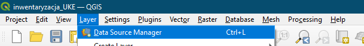
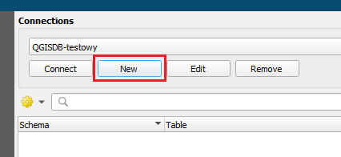
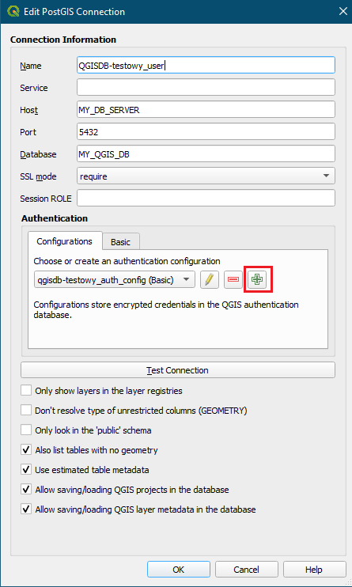
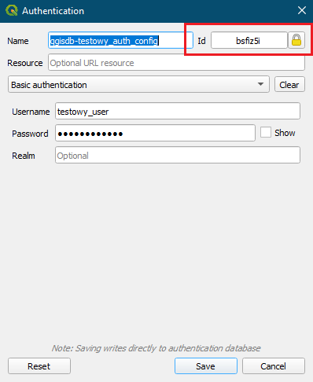

UWAGA! W konfiguracji autentykacji (ostatni obrazek) zaznaczyłem **ID**. To ID powinno być **wspólne dla wszystkich userów** korzystających z jednej
bazy QGIS-a. Zarówno sam projekt, jak i poszczególne warstwy mają w URI jakieś ID. Jeśli po utworzeniu projektu i zapisaniu
go w bazie wraz z warstwami spróbuje go otworzyć użytkownik z innym ID - to owszem, projekt otworzy, ale warstwy już się
nie wczytają. Powodem jest właśnie inne ID (można je podejrzeć w źródle warstwy).  
  
Rozwiązaniem tego problemu jest tworzenie kolejnych użytkowników (na kolejnych stanowiskach pracy) z takim samym ID.  
  
- Połączenie konfigurujemy przez "warstwa -> menedżer źródeł danych":  
  
 

- "nowe":  

 

- uzupełniamy jak na obrazku:

 

- a następnie - najważniejsze - dodajemy konfigurację autentykacji (plusik zaznaczony na obrazku wyżej):

 

