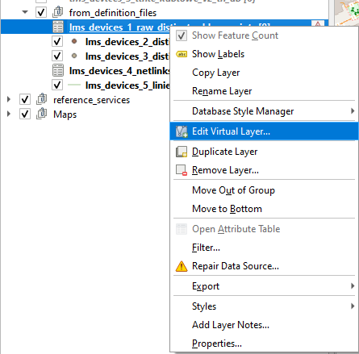
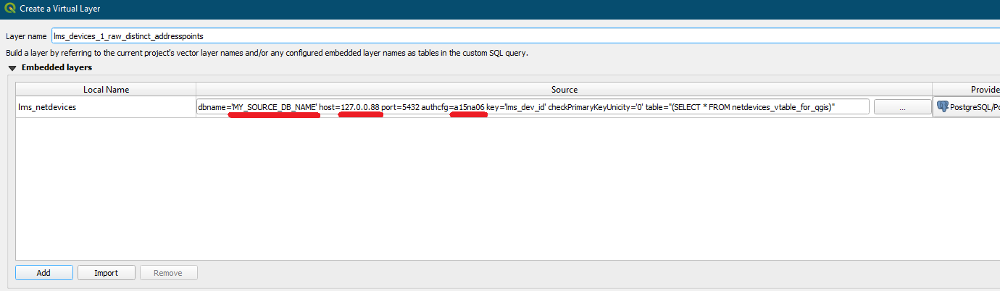

Tu na szybko: w projekcie jest 5 warstw wirtualnych, które **na pewno się nie wczytają**. Jeśli nie zamierzacie pobierać
danych z zewnętrznego serwera - można je śmiało usunąć. Jeśli zamierzacie - trzeba je zmodyfikować poprzez **edycję warstwy wirtualnej**
(prawy klik na warstwie):  

 

następnie podmieniamy podkreślone elementy - adres serwera, nazwę bazy oraz (opcjonalnie) authcfg - czyli ID wspomniane już w części dotyczącej instalacji postgresa:  

 
